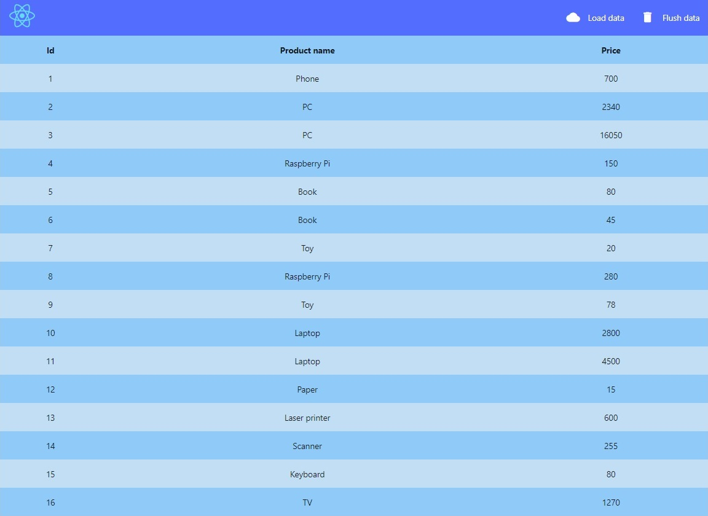

# ASK2020 lab01 docker
**Cel ćwiczenia:** Wykorzystanie konteneryzacji do przygotowania środowiska deweloperskiego aplikacji o rozproszonej architekturze

## Uruchomienie aplikacji bez dockera
Przed przejściem do wykonania zadania, przetestuj wpierw działanie aplikacji bez dockera.

### Wymagania
Do uruchomienia aplikacji potrzebne są:
* Git do sklonowania repo
* Node.js w wersji 12.16.3 (aplikacja działa również na wersji 10.19.0, dostępnej domyślnie w repo apt na Ubuntu) jako środowisko uruchomieniowe serwera oraz npm do jego wystartowania i instalacji zależności
* Nginx do uruchomienia klienta (można również przez npm)
* mysql/mariadb jako baza danych

### Kroki
0. Sklonuj repozytorium za pomocą `git clone` (lub wbudowanego narzędzia w IDE).
1. Uruchom bazę danych i wykonaj import ze [skryptu](db/db.sql):
    ```bash
    mysql -uroot < /path/to/db.sql
    ```
    Jeżeli wymagane jest hasło, dodaj opcję `-p`. Jest też możliwość wykorzystania polecenia `sudo` do połączenia się przez Unix socket jako root (serwer BD musi znajdować się na maszynie, z której uruchamiane jest polecenie):
    ```bash
    sudo mysql < /path/to/db.sql
    ```
2. Zainstaluj wszystkie zależności serwera, uruchamiając z katalogu [server](server) komendę `npm install`.
3. Uruchom serwer komendą `npm run dev`.
4. Zainstaluj zależności aplikacji klienckiej, uruchamiając w katalogu [client](client) komendę `npm install`.
5. Aplikację frontendową można uruchomić na dwa sposoby:
    1. W wersji deweloperskiej, z wykorzystaniem polecenia `npm start`.
    2. Produkcyjnie: zbuduj projekt poleceniem `npm run build`. Zostanie utworzony katalog _build_ z produkcyjną wersją aplikacji. Uruchom serwer nginx i umieść zawartość katalogu [client](build) w DocmuentRoot ([Nginx](https://stackoverflow.com/questions/10674867/nginx-default-public-www-location)). Przykładowa nazwa katalogu: docker-ui. Przykładowy config, za pomocą którego można uruchomić tą aplikację znajduje się w katalogu [client/nginx.conf](client/nginx.conf). Wymaga on pewnych modyfikacji.
6. W przeglądarce wejdź pod adres klienta z punktu 5. W przypadku nginx, omyślnie localhost/nazwa_serwisu, np. localhost/docker-ui. Jeżeli apka uruchamiana jest w wersji deweloperskiej, wówczas będzie to adres localhost:3000.
7. Poprawnie skonfigurowana aplikacja wyświetli listę produktów.
    

## Zadania
1. Uruchom aplikacje w dockerze, korzystając z [docker-cli](https://docs.docker.com/engine/reference/commandline/cli/). Stwórz odpowiednie [Dockerfile](https://docs.docker.com/engine/reference/builder/):
    1. [Node.js](https://hub.docker.com/_/node/). Uruchom serwer poleceniem `npm start`. Sprawdź poprawność działania, uruchamiając w przeglądarce endpoint: _localhost:8080/api/_.
    2. [MySQL](https://hub.docker.com/_/mysql) lub [MariaDB](https://hub.docker.com/_/mariadb). Zaimportuj schemat ze skryptu [db.sql](db/db.sql). Wykorzystaj [docker volume](https://docs.docker.com/storage/volumes/) do przechowania stanu bazy danych.
    3. [Nginx](https://hub.docker.com/_/nginx). Następnie, skopiuj zawartość katalogu client w odpowiednie dla wybranego serwera miejsca.
2.  Jeśli kontenery uruchamiają się bez błędów, przejdź do połączenia ich ze sobą, by klient wyświetlał poprawne dane.
    1. **Serwer**: Pamiętaj, by ustawić odpowiednie zmienne środowiskowe, zawarte w pliku [.env](server/.env), które wykorzystane zostały w [configu](server/src/config.js).
    2. **Baza danych**: Sprawdź, czy istnieje możliwość podłączenia się do bazy:
        ```bash
        docker exec -it container_name mysql -udockerdb -p
        ```
    3. **Klient**: W kontenerze należy uruchomić wersję produkcyjną aplikacji. Wpierw należy ją zbudować (`npm run build`). Po zbudowaniu należy skopiować kod wynikowy do kontenera z nginx, przy okazji dostarczając mu odpowiedni config.
        1. Kod źródłowy nie powinien znajdować się w kontenerze. Wykorzystaj w tym celu [multi-stage build](https://docs.docker.com/develop/develop-images/multistage-build/). W pierwszym zbuduj projekt, w drugim skopiuj build do kontenera z nginx.
        2. Config nginx powinien zawierać odpowiedni upstream do backendu, tak aby można było skonfigurować do niego proxy. Prawidłowy config znajduje się już w katalogu z klientem. Przeanalizuj jego budowę i opisz w sprawozdaniu.
3. Połącz odpowiednie kontenery ze sobą, korzystając z nazw kontenerów, zamiast adresów IP, korzystając **wyłącznie** z docker-cli.
4. Stwórz następującą konfigurację w formie [docker-compose.yml](https://docs.docker.com/compose/compose-file). Za `x` podstaw wartość obliczoną wg wzoru: `numer_albumu mod 200`. Na maszynę hosta udostępnij wyłącznie port do aplikacji klienckiej.
    

## Uwagi
1. Wydziel [zmienne środowiskowe](https://docs.docker.com/compose/environment-variables/) charakterystyczne dla różnych serwisów. Możesz w tym celu wykorzystać plik dotenv (.env).
2. Wykorzystaj [.dockerignore](https://docs.docker.com/engine/reference/builder/#dockerignore-file), by nie kopiować zbędnych plików i katalogów. Dotyczy to w szczególności kluczy, passphrasów, tokenów, itp. W niniejszym projekcie takie dane zawarte zostały w pliku .env.
3. Jeżeli wskazana w zadaniu pula adresów koliduje z Waszym DHCP, możecie zmienić ją na inną.
4. Przemyśl kwestię przechowywania stanu bazy danych. Usunięcie kontenera (lub `docker-compose down -v`) spowoduje usunięcie danych zawartych w bazie, w tym stworzonych wolumenów. Dla środowisk testowych nie jest to problemem, gdyż baza testowa zwykle nie ulega częstym zmianom i import ze skryptu wystarczy. Jednak w przypadku środowiska produkcyjnego jest to niedopuszczalne. [Więcej info](https://stackoverflow.com/questions/39175194/docker-compose-persistent-data-mysql).
5. W sprawozdaniu należy przedstawić sposób dojścia do finalnego rozwiązania. Proszę zawrzeć stosowne Dockerfile, komendy CLI, a w przypadku ostatniego zadania docker-compose. Opis powinien być sformułowany w sposób umożliwiający odtworzenie przebiegu ćwiczenia.

## Materiały
1. https://docs.docker.com/compose/networking/
2. https://docs.docker.com/compose/
3. https://docs.docker.com/network/network-tutorial-standalone/
4. https://stackoverflow.com/questions/43322033/create-database-on-docker-compose-startup/43324472
5. https://www.digitalocean.com/community/questions/how-to-ping-docker-container-from-another-container-by-name
6. https://dev.to/sonyarianto/how-to-spin-mysql-server-with-docker-and-docker-compose-33b2
7. https://runnable.com/docker/rails/docker-container-linking
8. https://serverfault.com/questions/989046/docker-compose-only-exposing-one-network-to-the-outside-world